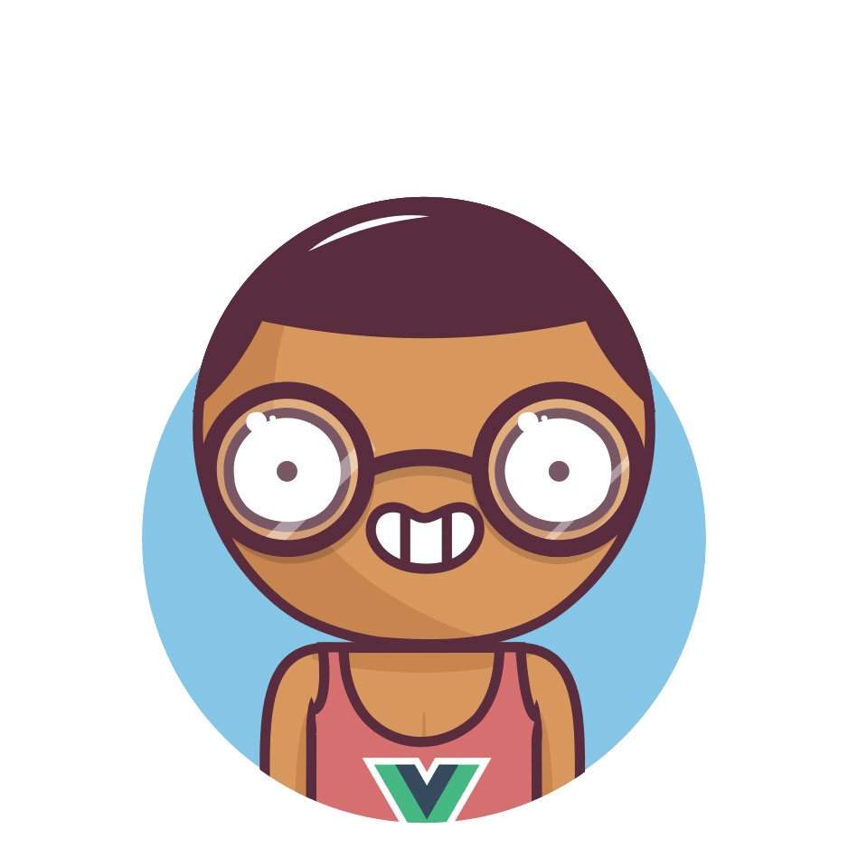

# Bean Heads Vue

  

Easily generate avatars for your projects with Bean Heads Vue.

> This project is a Vue version inspired by RobertBroersma's React project, [Beanheads](https://github.com/RobertBroersma/beanheads). We deeply respect and appreciate the original work.

## License

This project is licensed under the [MIT License](https://opensource.org/license/MIT).
